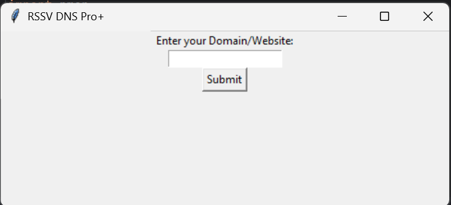

# RSSV DNS Pro+

A Python-based GUI network utility built with Tkinter, designed for DNS resolution, port scanning, ping tests, WHOIS lookups, mail record checks, and simulated DDoS testing.

## ⚠️ Disclaimer
**This project is intended for educational and non-commercial use only.** It is not recommended for deployment in professional or production environments. The tool is best suited for students, hobbyists, or those exploring networking concepts in a controlled setting.

## 🚀 Table of Contents
1. [Prerequisites](#prerequisites)
2. [Installation](#installation)
   - [Ubuntu](#ubuntu)
   - [Debian](#debian)
   - [Windows 11](#windows-11)
3. [Usage](#usage)
4. [Screenshots](#screenshots)
5. [Support & Star the Project](#support--star-the-project)
6. [License](#license)

---

## 📋 Prerequisites

Before you begin, ensure you have the following installed on your system:

- **Python 3.7+**
- **pip** (Python package manager)
- **nmap** (network scanner binary)
- **Git** (to clone the repository)

Additionally, the following Python libraries are required:

```bash
pip install python-nmap python-whois psutil requests
```

> **Note:** On Linux, you may also need to install `python3-tk` for Tkinter support.

---

## 🛠️ Installation

### Ubuntu

1. **Update package lists**
   ```bash
   sudo apt update
   ```
2. **Install system dependencies**
   ```bash
   sudo apt install python3 python3-pip python3-tk git -y
   ```
3. **Clone the repository**
   ```bash
   git clone https://github.com/shravankumaruk/rssvdnspro.git
   cd rssvdnspro
   ```
4. **Install Python dependencies**
   ```bash
   pip3 install python-nmap python-whois psutil requests
   ```

### Debian

1. **Update package lists**
   ```bash
   sudo apt-get update
   ```
2. **Install system dependencies**
   ```bash
   sudo apt-get install python3 python3-pip python3-tk git -y
   ```
3. **Clone & install dependencies**
   ```bash
   git clone https://github.com/shravankumaruk/rssvdnspro.git
   cd rssvdnspro
   pip3 install python-nmap python-whois psutil requests
   ```

### Kali Linux

1. **Update package lists**
   ```bash
   sudo apt update
   ```
2. **Install system dependencies**
   ```bash
   sudo apt install python3 python3-pip python3-tk git -y
   ```
3. **Clone & install dependencies**
   ```bash
   git clone https://github.com/shravankumaruk/rssvdnspro.git
   cd rssvdnspro
   pip3 install python-nmap python-whois psutil requests
   ```

### Windows 11

1. **Install Python 3** from the [official website](https://www.python.org/downloads/windows/) and ensure "Add Python to PATH" is checked during setup.
2. **Open Command Prompt (CMD)**
3. **Clone the repository**
   ```cmd
   git clone https://github.com/shravankumaruk/rssvdnspro.git
   cd rssvdnspro
   ```
4. **Install Python dependencies**
   ```cmd
   pip install python-nmap python-whois psutil requests
   ```

> **Note:** This approach uses only Python packages—no external binaries are required.

> **Installer for Windows** is under build and will be available soon.

## ▶️ Usage## ▶️ Usage

Open a terminal or PowerShell/CMD, navigate to the project folder, and run:

```bash
# On Linux
python3 main.py

# On Windows
python main.py
```

The GUI window will launch, allowing you to enter a domain or IP and choose from various network operations.

---

## 📸 Screenshots

### Entering Website Details



### Menus / Options 


### Output demo


---

## ⭐ Support & Star the Project

If you find this tool useful, please ⭐ **star** the repository on GitHub:

[GitHub • RSSV DNS Pro+](https://github.com/shravankumaruk/rssvdnspro)

Your support motivates further improvements and features!

---

## 📝 License

This project is licensed under the GNU General Public License v3.0 (GPL-3.0). You are free to use, share, and modify this software under the terms of the GPL-3.0. See [LICENSE.md](LICENSE.md) for the full license text.

---
**Installer for Windows is under build and will be available soon.**


*Happy networking!*
